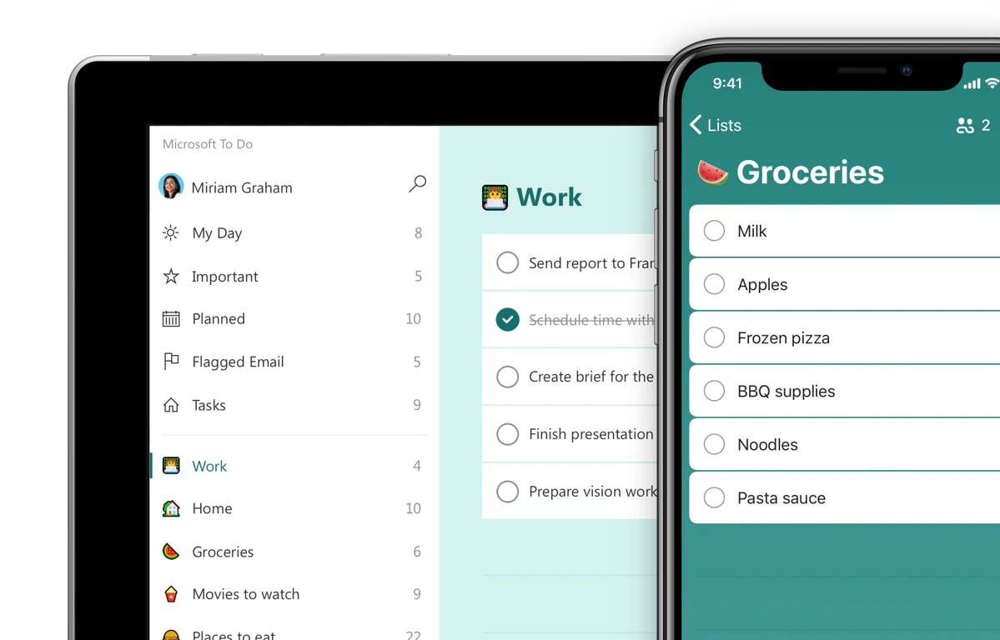
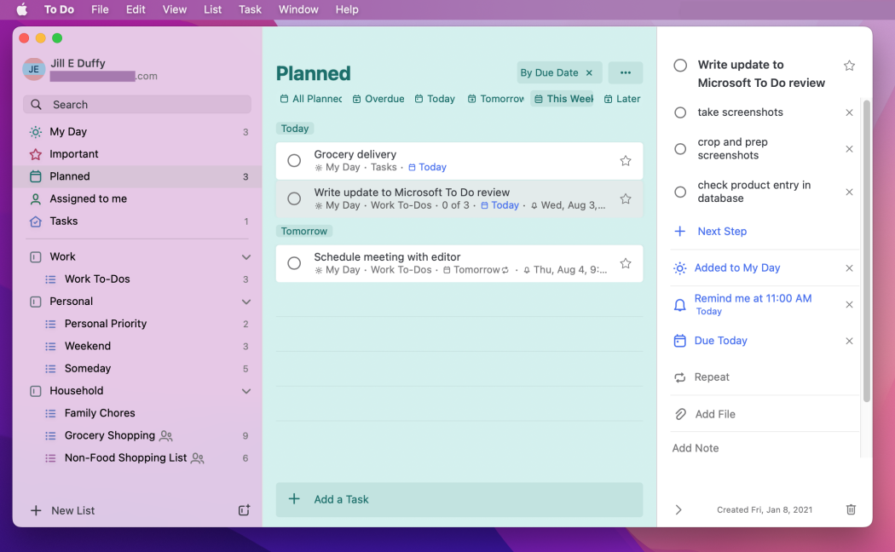

# Design

The to-do list application will be built using a standard three-tier architecture, with a front-end client, a backend server, and a database. The front-end client will be implemented using HTML, CSS, and JavaScript, and will communicate with the backend server using a RESTful API. The backend server will be implemented using Python and the Flask framework, and will use a MySQL database to store the tasks and other application data.

# User interface design:

The user interface for the to-do list application will be clean and simple, with a focus on ease of use. The main screen will display a list of tasks, with the ability to filter and sort the tasks by various criteria. Each task will have a title, description, and due date, and will be displayed in a card-like layout. The user will be able to create, edit, and delete tasks using simple form inputs.

## Wireframe

Screenshots of wireframes

some caption.

## Mockups

Screenshots of mockups

some caption.

# Demo
[To-do List App](https://todo.microsoft.com/)