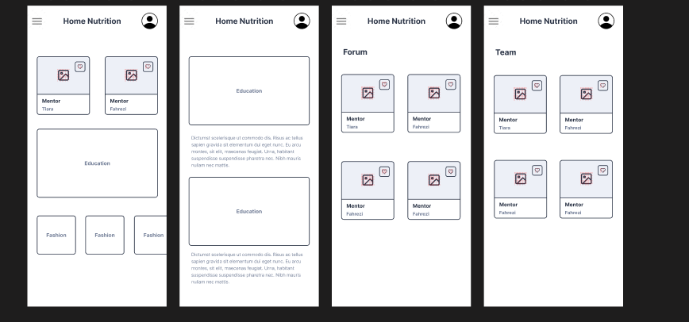
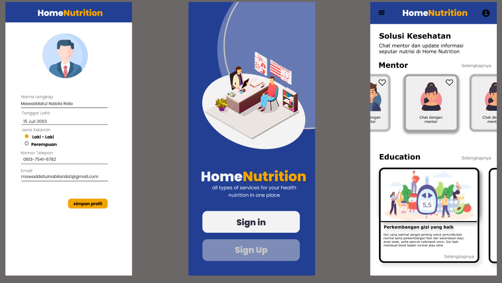

# Design

Untuk membuat aplikasi HomeNutrition, menggunakan bahasa pemrograman JavaScript dan framework. menggunakan platform seperti Ruby on Rails atau Django Nest.js (untuk JavaScript) untuk membangun aplikasi. Juga menggunakan platform pengembangan web seperti React Native untuk membuat aplikasi yang dapat dijalankan pada platform mobile.
Selain itu, menggunakan database seperti MySQL, MongoDB atau Firebase untuk menyimpan dan mengambil data nutrisi yang diperlukan.

# User interface design:

User interface (UI) dari aplikasi HomeNutrition adalah :
Navigation menu: Menyediakan akses ke berbagai fitur aplikasi, mentor, team, education, artikel dan profil pengguna.
Artikell : Menampilkan informasi kalori dan nutrisi dari makanan yang ditambahkan ke daftar makanan harian pengguna.
Profile: Menampilkan profil pengguna dan riwayat makanan yang dikonsumsi.
Mentor : Orang terpercaya mengenai hal nutrisi

## Wireframe

Screenshots of wireframes

## Mockups

Screenshots of mockups

# Demo
[To-do List App]
https://www.figma.com/file/91ZF5WPubvUUFFT0P0ZLZg/02.-User-Flows-Resource-(Nabila)?node-id=66189%3A1547&t=ObgdheQT1bOdrHq4-1
https://www.figma.com/file/P7VuS4qq4Elt9lA7GUH24J/Untitled?node-id=2%3A3&t=tdFP53C4MnBXBTVX-1